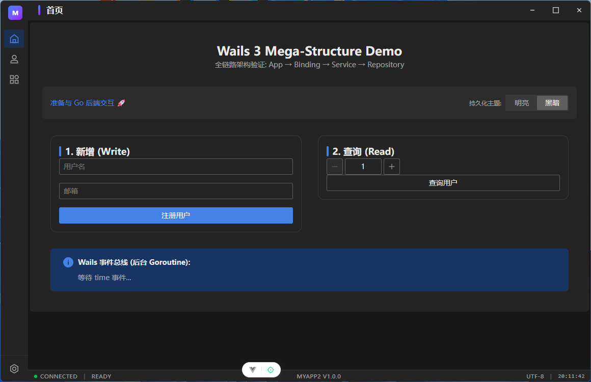
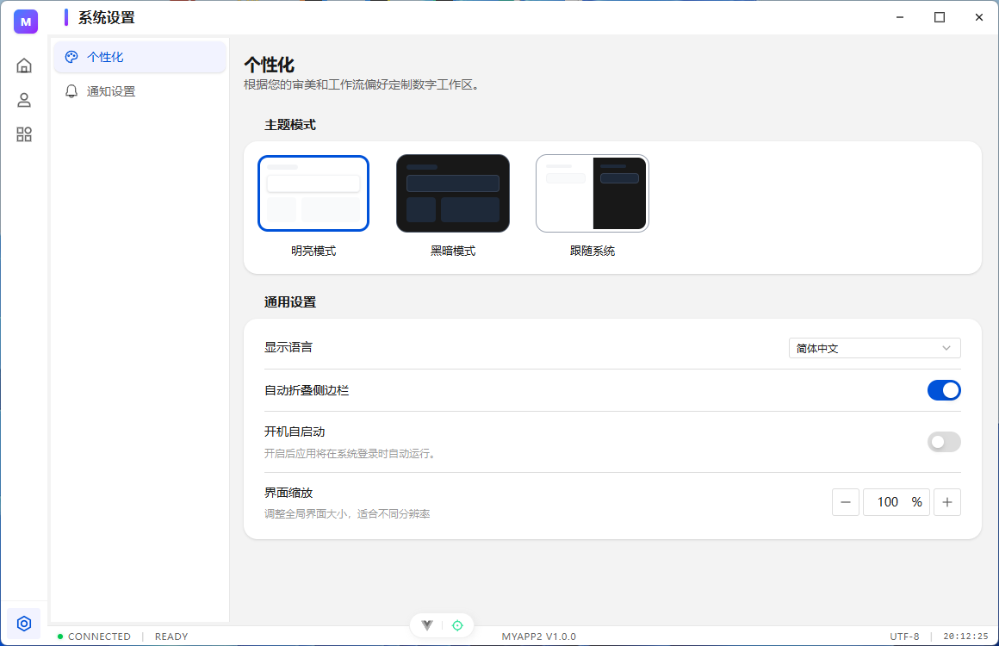
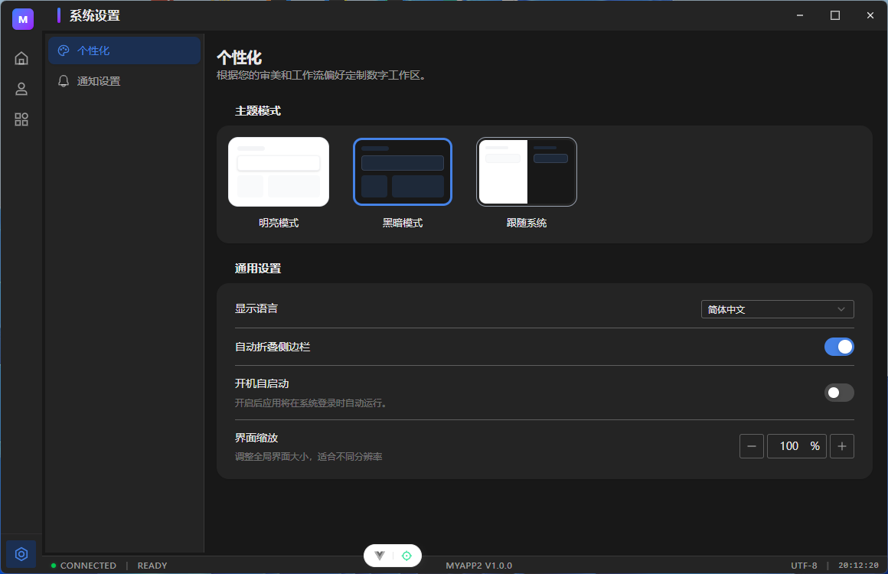
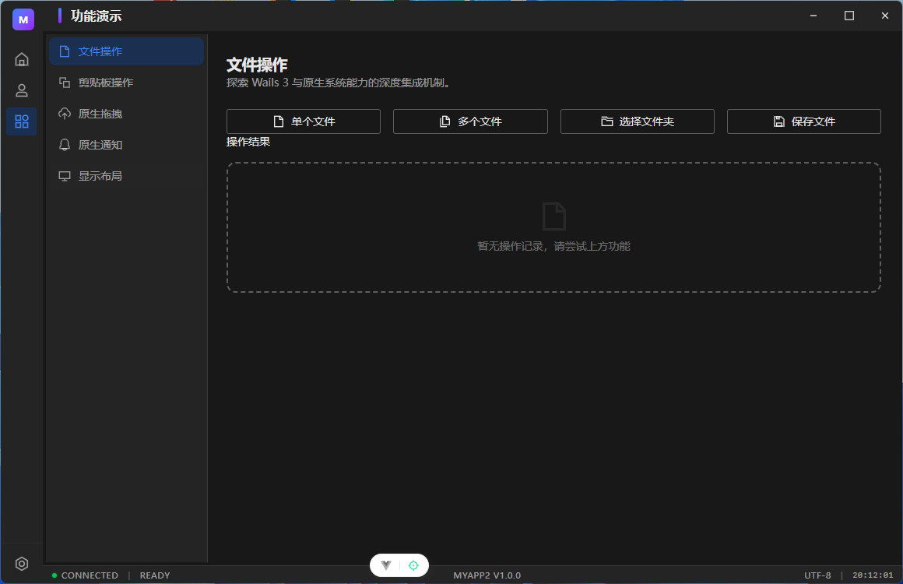
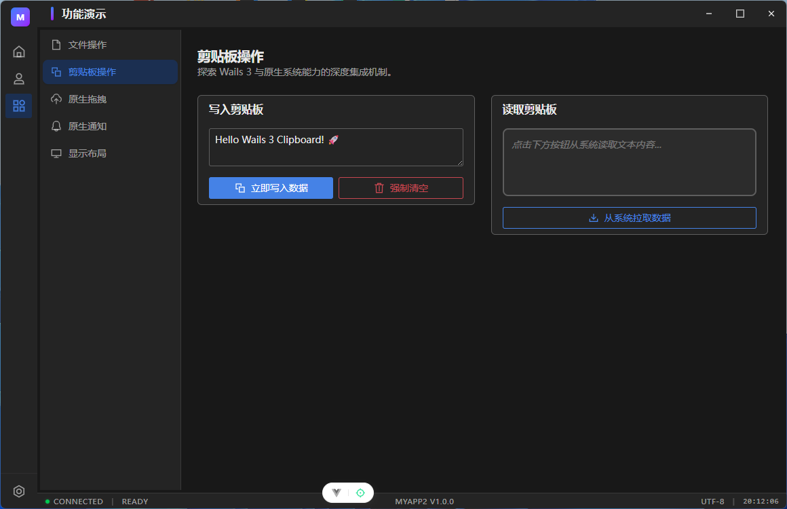
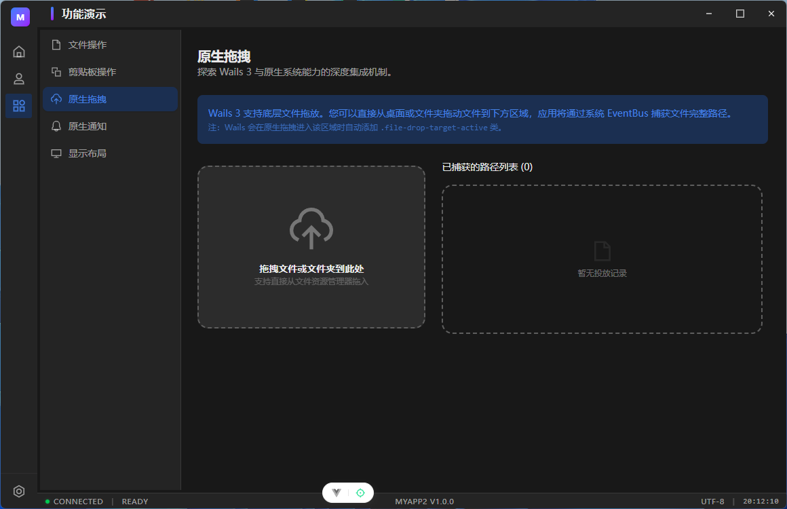
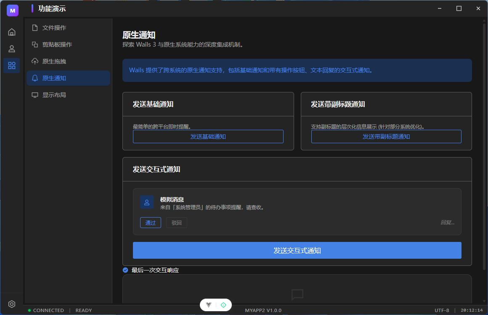
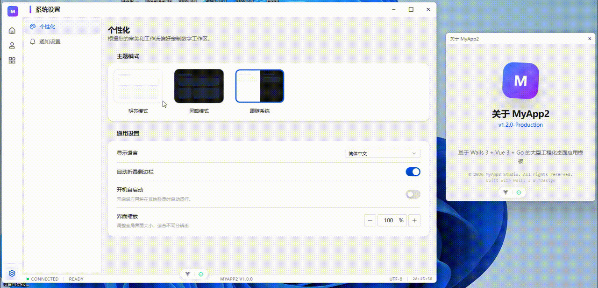

# wails3-vue3-template - Wails 3 企业级桌面应用模板

<div align="center">

**[English](README.md) | [简体中文](README_zh.md)**

**基于 Wails v3 构建的生产级、企业级桌面应用模板**

[](https://wails.io)
[](https://go.dev)
[](https://vuejs.org)
[](LICENSE)

[功能特性](#功能特性) • [截图展示](#截图展示) • [快速开始](#快速开始) • [架构设计](#架构设计) • [文档](#文档)

</div>

---

## 项目简介

wails3-vue3-template 是一个全面的桌面应用程序模板，展示了构建跨平台桌面应用的 **Wails v3 最佳实践**。它结合了 Go 强大的后端能力和 Vue 3 现代的前端生态系统，为企业级应用提供了坚实的基础。

### 为什么选择这个项目？

- 🚀 **生产就绪**：包含日志、配置、数据库迁移、错误处理和优雅关机
- 🏗️ **清晰架构**：分层设计（Binding → Service → Repository → Domain）易于维护
- 🎨 **现代 UI**：基于 Vue 3、TDesign 组件库和 Tailwind CSS 4 构建
- 🌍 **国际化**：完整的中英文多语言支持
- 🌓 **主题系统**：浅色/深色/自动主题，与系统偏好同步
- 💾 **持久化**：SQLite + GORM 自动迁移
- 📦 **独立分发**：单二进制文件，内嵌所有资源

---

## 截图展示

<table>
  <tr>
    <td align="center"><b>首页</b></td>
    <td align="center"><b>主题模式</b></td>
  </tr>
  <tr>
    <td></td>
    <td></td>
  </tr>
  <tr>
    <td align="center"><b>配置中心</b></td>
    <td align="center"><b>文件操作</b></td>
  </tr>
  <tr>
    <td></td>
    <td></td>
  </tr>
  <tr>
    <td align="center"><b>剪切板操作</b></td>
    <td align="center"><b>原生拖拽</b></td>
  </tr>
  <tr>
    <td></td>
    <td></td>
  </tr>
  <tr>
    <td align="center"><b>原生通知</b></td>
    <td align="center"><b>多窗口状态共享</b></td>
  </tr>
  <tr>
    <td></td>
    <td></td>
  </tr>
</table>

---

## 功能特性

### 核心能力

- **多窗口管理**：创建和管理多个独立窗口，集成系统托盘
- **用户管理**：完整的 CRUD 示例，包含分页、搜索和表单验证
- **设置持久化**：实时设置同步，自动持久化到数据库
- **原生集成**：
    - 文件对话框（打开/保存/多选）
    - 剪贴板操作
    - 原生文件拖放
    - 带操作和回复的系统通知
- **状态管理**：Pinia 状态存储，支持路由状态保持
- **动态路由**：基于路由元数据自动生成侧边栏菜单
- **开发工具**：热重载、Vue DevTools、TypeScript 严格模式

### 开发体验

- **类型安全**：完整的 TypeScript 覆盖，自动生成绑定
- **代码质量**：ESLint、Oxlint、Prettier 和自动格式化
- **构建流水线**：使用 Taskfile 自动化的生产构建优化
- **日志系统**：结构化日志，支持日志轮转（Lumberjack）
- **配置管理**：基于 Viper 的 YAML 配置
- **错误处理**：统一的错误响应和 panic 恢复

---

## 技术栈

| 层级 | 技术选型 | 用途 |
|------|---------|------|
| **后端运行时** | Go 1.25+ | 核心业务逻辑与系统调用 |
| **桌面框架** | Wails v3 (alpha.74) | 连接 Go 后端与 WebView 前端 |
| **前端框架** | Vue 3 (Composition API) | 响应式 UI 组件 |
| **国际化** | Vue I18n 11 | 多语言支持 |
| **构建工具** | Vite 8 | 快速热重载和优化构建 |
| **UI 组件库** | TDesign Vue Next | 企业级组件库 |
| **CSS 引擎** | Tailwind CSS 4 | 原子化样式 |
| **状态管理** | Pinia 3 | 响应式状态与持久化 |
| **路由** | Vue Router 5 (Hash 模式) | 多窗口路由支持 |
| **数据库** | SQLite (via GORM) | 本地数据持久化 |
| **日志** | Zap + Lumberjack | 结构化日志与轮转 |
| **配置中心** | Viper | YAML 配置管理 |
| **任务自动化** | Taskfile v3 | 跨平台构建任务 |

---

## 快速开始

### 环境要求

- **Go**: 1.25 或更高版本
- **Node.js**: ^20.19.0 或 >=22.12.0
- **pnpm**: 最新版本（推荐）或 npm/yarn

### 安装步骤

```bash
# 克隆仓库
git clone https://gitee.com/liiayy/wails3-vue3-template.git
cd wails3-vue3-template

# 安装前端依赖
cd frontend
pnpm install
cd ..

# 运行开发模式
wails3 dev
# 或者
task dev
```

就这样！应用会自动打开，前后端代码修改都会自动热重载。

### 生产构建

```bash
# 标准生产构建
wails3 build

# 优化构建（注入版本号）
task build:prod

# 指定版本构建
task build:prod APP_VERSION=2.1.0
```

输出文件在 `bin/` 目录中。

---

## 项目结构

```
myapp2/
├── main.go                          # 应用入口（依赖注入 & 启动）
├── go.mod / go.sum                  # Go 依赖
├── Taskfile.yml                     # 构建任务自动化
│
├── internal/                        # Go 私有核心包
│   ├── app/                         # Wails 生命周期管理
│   ├── binding/                     # 前端桥接层（控制器）
│   ├── buildinfo/                   # 编译期版本注入
│   ├── config/                      # Viper YAML 配置
│   ├── database/                    # GORM + SQLite 连接
│   ├── domain/                      # 领域模型 + Repository 接口
│   ├── logger/                      # Zap + Lumberjack 日志引擎
│   ├── manager/                     # 多窗口管理器 + 系统托盘
│   ├── repository/                  # SQLite 仓储实现
│   └── service/                     # 业务逻辑层
│
├── build/                           # Wails 构建配置 & 资源
│
└── frontend/                        # Vue 3 前端
    ├── bindings/                    # 自动生成的 TS 绑定（请勿编辑）
    ├── src/
    │   ├── main.ts                  # 前端入口
    │   ├── App.vue                  # 根组件
    │   ├── api/                     # API 抽象层
    │   ├── assets/                  # 静态资源
    │   ├── composables/             # Vue 组合式 API 工具箱
    │   ├── layouts/                 # 布局组件
    │   ├── locales/                 # i18n 语言文件
    │   ├── router/                  # Vue Router 配置
    │   ├── stores/                  # Pinia 状态存储
    │   └── views/                   # 页面组件
    ├── vite.config.ts               # Vite 配置
    └── package.json                 # 前端依赖
```

---

## 架构设计

### 分层架构

```
┌──────────────┐
│   前端       │  Vue 3 / TypeScript
│  (WebView)   │
└──────┬───────┘
       │  Wails JS SDK
┌──────▼───────┐
│   Binding    │  参数校验、错误处理
└──────┬───────┘  （控制器层）
       │
┌──────▼───────┐
│   Service    │  纯业务逻辑，可测试
└──────┬───────┘
       │
┌──────▼───────┐
│  Repository  │  GORM 数据库操作
└──────┬───────┘
       │
┌──────▼───────┐
│    Domain    │  实体模型 + 接口
└──────────────┘  零依赖，应用核心
```

**核心优势**：只需添加新的 Repository 实现即可更换数据库，上层代码**无需修改**。

### 依赖注入流程

```go
// main.go 启动顺序：
config.InitConfig()           // 0. 加载 YAML 配置
logger.InitLogger()           // 1. 初始化日志
database.InitDB()             // 2. 连接 SQLite
  → repository.New...()       // 3. 创建仓储
    → service.New...()        // 4. 创建服务
      → binding.New...()      // 5. 创建桥接
application.New(bindings...)  // 6. 组装 Wails 应用
manager.NewWindowManager()    // 7. 创建窗口 & 托盘
wailsApp.Run()                // 8. 运行事件循环
```

---

## 文档

- **[架构指南](ARCHITECTURE.md)** - 详细的架构文档
- **[开发指南](CLAUDE.md)** - 贡献者开发说明
- **[Wails 文档](https://wails.io/docs/next/introduction)** - Wails v3 官方文档

---

## 核心特性深度解析

### 1. 生产构建流水线

`task build:prod` 命令提供：
- **安全增强**：生产环境自动移除 Vue DevTools
- **编译期注入**：通过 ldflags 注入版本号和环境标识
- **二进制优化**：`-trimpath`、`-s -w` 减小体积
- **隐藏控制台**：Windows 下使用 `-H windowsgui`

### 2. 主题与国际化

- **跟随系统**：浅色/深色/自动模式，实时同步 OS 设置
- **双语支持**：中英文切换，基于 Vue I18n + TDesign
- **状态持久**：设置自动同步到 SQLite（通过 Pinia）

### 3. Vue Composables 工具箱

使用可复用的 composables 消除样板代码：
- `useAsyncAction(fn)`：自动 loading/error 状态包装
- `useWailsEvent(name)`：无内存泄漏的事件订阅
- `useWindowControl()`：无状态窗口控制 API
- `useDebounce(ref)`：响应式防抖

### 4. 完整 CRUD 示例

`UserManageView.vue` 展示了：
- 服务端分页（Offset/Limit）
- 防抖搜索（LIKE 查询）
- TDesign 数据表格与行内操作
- 创建/编辑模态框
- 删除二次确认

### 5. SQLite + GORM

数据库位置：`AppData/MyApp2/data/app_data.db`
- AutoMigrate 自动迁移
- 外键约束
- 事务支持
- 连接池

### 6. 结构化日志

日志文件：`AppData/MyApp2/logs/app.log`
- 单文件 50MB 自动切割
- 最多保留 10 个备份文件
- 保留 30 天，gzip 压缩
- 基于等级的过滤优化性能

### 7. 优雅停机

应用退出时清理：
- 释放文件锁
- 刷新日志缓冲
- 关闭数据库连接
- 注销系统托盘

### 8. 多窗口与托盘

- 独立窗口管理
- 系统托盘与右键菜单
- 窗口状态持久化
- 跨平台托盘图标

---

## 开发任务

### 添加后端服务

1. 在 `internal/domain/` 定义领域模型
2. 在 `internal/repository/` 创建仓储
3. 在 `internal/service/` 实现业务逻辑
4. 在 `internal/binding/` 暴露接口
5. 在 `main.go` 注册服务
6. 运行 `wails3 generate bindings --ts -clean=true`
7. 在 `frontend/src/api/` 添加前端封装

### 添加前端页面

1. 在 `frontend/src/views/` 创建 `*.vue`
2. 在 `frontend/src/router/index.ts` 添加路由
3. 配置菜单元数据：
   ```typescript
   meta: {
     showInMenu: true,
     menuSection: 'top', // 或 'bottom'
     title: 'menu.new_page',
     icon: 'desktop'
   }
   ```
4. 在 `locales/` 添加 i18n 键值

### 常用命令

```bash
# 开发
wails3 dev              # 完整开发模式（热重载）
task dev                # 同上

# 构建
wails3 build           # 标准构建
task build:prod        # 优化构建
task package:prod      # 创建安装包

# 仅前端
cd frontend
pnpm dev               # 前端开发服务器
pnpm build             # 生产构建
pnpm lint              # 代码检查
pnpm format            # 代码格式化

# 代码生成
wails3 generate bindings --ts -clean=true  # 重新生成绑定
wails3 generate icons                     # 生成应用图标
```

---

## 安全策略

| 数据类型 | 存储位置 | 用户可改 | 示例 |
|----------|----------|----------|------|
| 环境标识/版本号 | 🔒 编译期 ldflags | ❌ | `IsDev`, `Version` |
| 部署配置 | 📄 config.yaml | ✅ | 窗口大小、日志级别 |
| 用户偏好 | 🗂️ SQLite (Pinia) | ✅ | 主题、语言、布局 |
| 业务数据 | 🗂️ SQLite (GORM) | ✅ | 用户记录 |

---

## 贡献指南

欢迎贡献！请遵循以下准则：

1. Fork 本仓库
2. 创建特性分支 (`git checkout -b feature/amazing-feature`)
3. 提交更改 (`git commit -m 'Add amazing feature'`)
4. 推送到分支 (`git push origin feature/amazing-feature`)
5. 开启 Pull Request

### 代码规范

- **Go**: 遵循标准 Go 规范，运行 `gofmt`
- **TypeScript/Vue**: 使用 ESLint 和 Prettier (`pnpm lint && pnpm format`)
- **提交信息**: 使用约定式提交格式

---

## 开源协议

本项目采用 MIT 协议 - 详见 [LICENSE](LICENSE) 文件

---

## 致谢

- [Wails](https://wails.io) - 优秀的桌面应用框架
- [Vue.js](https://vuejs.org) - 渐进式 JavaScript 框架
- [TDesign](https://tdesign.tencent.com/) - 企业级 Vue 组件库
- [Tailwind CSS](https://tailwindcss.com) - 原子化 CSS 框架

---

<div align="center">

**使用 Wails v3 构建 ❤️**

[报告问题](https://gitee.com/liiayy/wails3-vue3-template/issues) · [功能建议](https://gitee.com/liiayy/wails3-vue3-template/issues)

</div>
